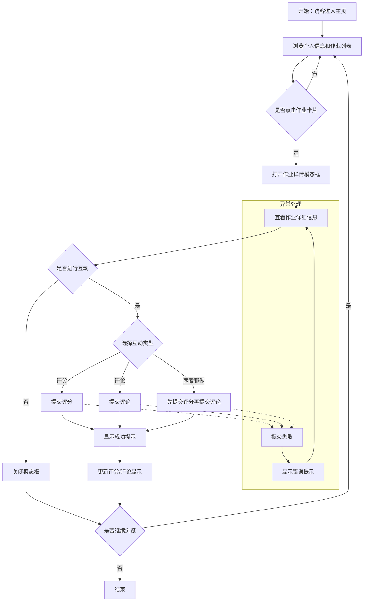

# 产品需求文档：AIGC浩然学长个人主页 - V1.0

## 1. 综述 (Overview)
### 1.1 项目背景与核心问题
AIGC浩然学长需要一个个人主页来展示Vibe Coding系列课程的8个作业作品，方便老师评判和访客观看提建议。该主页需要包含自我介绍板块、作业展示区域以及互动功能（评分和评论），支持响应式设计适配手机和电脑，能够快速部署到GitHub和Vercel。

### 1.2 核心业务流程 / 用户旅程地图
1. **阶段一：内容展示** - 访客能够浏览个人信息和8个作业卡片
2. **阶段二：详情查看** - 访客点击作业卡片可以查看作业的详细信息
3. **阶段三：互动反馈** - 访客可以对作业进行评分和评论

### 1.3 Mermaid 图（流程/状态/时序）
> 说明：Mermaid 图用于"需求对齐"，避免歧义；避免写成技术实现细节（不要写 API 路径、字段、HTTP code、框架/库）。

#### 1.3.1 用户操作流（必填）


## 2. 用户故事详述 (User Stories)

### 阶段一：内容展示

---

#### **US-01: 浏览个人信息**
*   **价值陈述 (Value Statement)**:
    *   **作为** 访客
    *   **我希望** 能够快速了解AIGC浩然学长的基本信息和背景
    *   **以便于** 判断这个主页是否值得关注
*   **业务规则与逻辑 (Business Logic)**:
    1.  **前置条件**: 访客打开浏览器访问主页URL
    2.  **操作流程 (Happy Path)**:
        - 系统展示个人信息面板（桌面端左侧28%，手机端顶部）
        - 显示头像占位符
        - 显示姓名：AIGC浩然学长
        - 显示简介：一个看不懂代码的程序员，Vibe Coding 爱好者
        - 显示邮箱：hcx20200708@gmail.com（可点击mailto链接）
    3.  **异常处理 (Error Handling)**:
        - 头像加载失败：显示默认占位符
        - 邮箱地址：做防爬虫处理
*   **验收标准 (Acceptance Criteria)**:
    *   **场景1: 桌面端访问**
        *   **GIVEN** 访客使用桌面设备访问主页
        *   **WHEN** 页面加载完成
        *   **THEN** 个人信息面板显示在页面左侧，宽度占28%
    *   **场景2: 手机端访问**
        *   **GIVEN** 访客使用手机设备访问主页
        *   **WHEN** 页面加载完成
        *   **THEN** 个人信息面板显示在页面顶部
    *   **场景3: 邮箱可点击**
        *   **GIVEN** 访客看到邮箱地址
        *   **WHEN** 访客点击邮箱地址
        *   **THEN** 系统打开邮件客户端，收件人为hcx20200708@gmail.com
    *   **场景4: 头像加载失败**
        *   **GIVEN** 头像图片URL无效或加载失败
        *   **WHEN** 页面加载完成
        *   **THEN** 显示默认占位符
---
*   **页面布局线框图 (ASCII Wireframe)**:
    ```text
    【桌面端布局】
    +---------------------------+---------------------------------------------------+
    |                           |                                                   |
    |    个人信息面板 (28%)     |              作业展示区域 (72%)                   |
    |                           |                                                   |
    |    ┌─────────────────┐   |   [作业卡片1]  [作业卡片2]  [作业卡片3]          |
    |    │                 │   |                                                   |
    |    │    [头像占位符]  │   |   [作业卡片4]  [作业卡片5]  [作业卡片6]          |
    |    │                 │   |                                                   |
    |    └─────────────────┘   |   [作业卡片7]  [作业卡片8]                        |
    |                           |                                                   |
    |    AIGC浩然学长           |                                                   |
    |                           |                                                   |
    |    一个看不懂代码的程序   |                                                   |
    |    员，Vibe Coding 爱好者|                                                   |
    |                           |                                                   |
    |    📧 hcx20200708@gmail.com|                                                   |
    |                           |                                                   |
    +---------------------------+---------------------------------------------------+

    【手机端布局】
    +---------------------------------------------------+
    |                                                   |
    |              个人信息面板 (顶部)                   |
    |                                                   |
    |              [头像占位符]                          |
    |                                                   |
    |              AIGC浩然学长                          |
    |                                                   |
    |    一个看不懂代码的程序员，Vibe Coding 爱好者       |
    |                                                   |
    |    📧 hcx20200708@gmail.com                        |
    |                                                   |
    +---------------------------------------------------+
    |                                                   |
    |              作业展示区域                         |
    |                                                   |
    |            [作业卡片1]                            |
    |            [作业卡片2]                            |
    |            [作业卡片3]                            |
    |            [作业卡片4]                            |
    |            [作业卡片5]                            |
    |            [作业卡片6]                            |
    |            [作业卡片7]                            |
    |            [作业卡片8]                            |
    |                                                   |
    +---------------------------------------------------+
    ```
---

#### **US-02: 浏览作业列表**
*   **价值陈述 (Value Statement)**:
    *   **作为** 访客
    *   **我希望** 能够一目了然地看到所有8个作业的概览信息
    *   **以便于** 快速了解每个作业的主题和状态
*   **业务规则与逻辑 (Business Logic)**:
    1.  **前置条件**: 访客已进入主页
    2.  **操作流程 (Happy Path)**:
        - 系统在作业展示区域显示8个作业卡片
        - 桌面端：一行4个卡片，共2行
        - 手机端：单列显示8个卡片
        - 每个卡片显示：图标、标题、描述、评分、评论数
        - 卡片按作业编号顺序排列（1-8）
    3.  **异常处理 (Error Handling)**:
        - 评分为0时显示：⭐ 0.0
        - 评论数为0时显示：💬 0
        - 描述为空时显示默认文案
*   **验收标准 (Acceptance Criteria)**:
    *   **场景1: 桌面端布局**
        *   **GIVEN** 访客使用桌面设备访问主页
        *   **WHEN** 页面加载完成
        *   **THEN** 作业卡片一行显示4个，共2行，按编号1-8顺序排列
    *   **场景2: 手机端布局**
        *   **GIVEN** 访客使用手机设备访问主页
        *   **WHEN** 页面加载完成
        *   **THEN** 作业卡片单列显示8个，按编号1-8顺序排列
    *   **场景3: 鼠标悬停效果**
        *   **GIVEN** 访客将鼠标悬停在作业卡片上
        *   **WHEN** 鼠标悬停
        *   **THEN** 卡片放大、阴影加深、边框高亮
    *   **场景4: 评分和评论数为0**
        *   **GIVEN** 作业暂无评分和评论
        *   **WHEN** 页面加载完成
        *   **THEN** 显示⭐ 0.0和💬 0
*   **作业列表（优化后名称+图标）**:
    1. 🔍 洞察之眼
    2. 🌊 数据之流
    3. 🤖 AI伙伴
    4. 🛠️ 编程助手
    5. 🚀 能力进化
    6. 🌐 部署上线
    7. ✨ 创意变现
    8. 🥚 从零开始
---
*   **页面布局线框图 (ASCII Wireframe)**:
    ```text
    【桌面端作业卡片布局】
    +---------------------------+---------------------------------------------------+
    |                           |                                                   |
    |    个人信息面板 (28%)     |              作业展示区域 (72%)                   |
    |                           |                                                   |
    |                           |   ┌─────────┐  ┌─────────┐  ┌─────────┐  ┌───────┐|
    |                           |   │ 🔍      │  │ 🌊      │  │ 🤖      │  │ 🛠️   │|
    |                           |   │洞察之眼 │  │数据之流 │  │AI伙伴   │  │编程助手│|
    |                           |   │描述...  │  │描述...  │  │描述...  │  │描述...│|
    |                           |   │⭐ 4.5   │  │⭐ 3.8   │  │⭐ 0.0   │  │⭐ 0.0 │|
    |                           |   │💬 12    │  │💬 8     │  │💬 0     │  │💬 0  │|
    |                           |   └─────────┘  └─────────┘  └─────────┘  └───────┘|
    |                           |                                                   |
    |                           |   ┌─────────┐  ┌─────────┐  ┌─────────┐  ┌───────┐|
    |                           |   │ 🚀      │  │ 🌐      │  │ ✨      │  │ 🥚   │|
    |                           |   │能力进化 │  │部署上线 │  │创意变现 │  │从零开始│|
    |                           |   │描述...  │  │描述...  │  │描述...  │  │描述...│|
    |                           |   │⭐ 0.0   │  │⭐ 0.0   │  │⭐ 0.0   │  │⭐ 0.0 │|
    |                           |   │💬 0     │  │💬 0     │  │💬 0     │  │💬 0  │|
    |                           |   └─────────┘  └─────────┘  └─────────┘  └───────┘|
    |                           |                                                   |
    +---------------------------+---------------------------------------------------+

    【单个作业卡片详细布局】
    ┌─────────────────────────┐
    │                         │
    │         🔍              │  ← 图标（居中，较大）
    │                         │
    │       洞察之眼          │  ← 标题（居中）
    │                         │
    │   学习如何发现用户痛点   │  ← 描述（居中，1-2行）
    │   并提出解决方案         │
    │                         │
    │   ⭐ 4.5    💬 12       │  ← 评分和评论数（底部，左右分布）
    │                         │
    └─────────────────────────┘

    【鼠标悬停效果示意】
    正常状态：          悬停状态：
    ┌─────────┐         ┌─────────────────┐
    │  🔍     │         │    🔍           │
    │洞察之眼 │   →     │  洞察之眼       │  ← 放大
    │⭐ 4.5   │         │  ⭐ 4.5         │  ← 阴影加深
    │💬 12    │         │  💬 12          │  ← 边框高亮
    └─────────┘         └─────────────────┘
    ```
---

### 阶段二：详情查看

---

#### **US-03: 查看作业详情**
*   **价值陈述 (Value Statement)**:
    *   **作为** 访客
    *   **我希望** 点击作业卡片后能够查看该作业的详细信息
    *   **以便于** 深入了解作业的内容和成果
*   **业务规则与逻辑 (Business Logic)**:
    1.  **前置条件**: 访客已进入主页，看到作业列表
    2.  **操作流程 (Happy Path)**:
        - 访客点击作业卡片或按Enter键
        - 系统打开模态框显示作业详情
        - 模态框显示：图标、标题、描述、评分、评论数、详细描述、作业链接、截图
        - 访客可通过三种方式关闭模态框（点击关闭按钮、点击背景区域、按ESC键）
    3.  **异常处理 (Error Handling)**:
        - 作业链接为空时，隐藏链接按钮
        - 截图加载失败时，显示默认占位图
        - 详细描述为空时，显示默认文案
*   **验收标准 (Acceptance Criteria)**:
    *   **场景1: 点击卡片打开模态框**
        *   **GIVEN** 访客看到作业列表
        *   **WHEN** 访客点击作业卡片
        *   **THEN** 系统打开模态框显示该作业的详细信息
    *   **场景2: 按Enter键打开模态框**
        *   **GIVEN** 访客将焦点聚焦在作业卡片上
        *   **WHEN** 访客按Enter键
        *   **THEN** 系统打开模态框显示该作业的详细信息
    *   **场景3: 关闭模态框**
        *   **GIVEN** 模态框已打开
        *   **WHEN** 访客点击关闭按钮/背景区域/按ESC键
        *   **THEN** 模态框关闭
    *   **场景4: 作业链接为空**
        *   **GIVEN** 作业没有设置链接
        *   **WHEN** 模态框打开
        *   **THEN** 不显示作业链接按钮
    *   **场景5: 截图加载失败**
        *   **GIVEN** 截图URL无效或加载失败
        *   **WHEN** 模态框打开
        *   **THEN** 显示默认占位图
---
*   **页面布局线框图 (ASCII Wireframe)**:
    ```text
    【桌面端模态框布局】
    ┌─────────────────────────────────────────────────────────────────┐
    │  ┌─────────────────────────────────────────────────────────┐   │
    │  │  🔍 洞察之眼                                    [X]    │   │  ← 标题栏（图标+标题+关闭按钮）
    │  └─────────────────────────────────────────────────────────┘   │
    │                                                                 │
    │  ┌─────────────────────────────────────────────────────────┐   │
    │  │                                                         │   │
    │  │                  [作业截图/预览图]                        │   │  ← 截图区域（大图，居中）
    │  │                                                         │   │
    │  │                  (800x400 或自适应)                     │   │
    │  │                                                         │   │
    │  └─────────────────────────────────────────────────────────┘   │
    │                                                                 │
    │  ⭐ 4.5    💬 12                                              │   │  ← 评分和评论数
    │                                                                 │
    │  ┌─────────────────────────────────────────────────────────┐   │
    │  │ 简短描述：                                                │   │  ← 卡片上的简短描述
    │  │ 学习如何发现用户痛点并提出解决方案                         │   │
    │  └─────────────────────────────────────────────────────────┘   │
    │                                                                 │
    │  ┌─────────────────────────────────────────────────────────┐   │
    │  │ 详细描述：                                                │   │  ← 详细描述
    │  │ 本作业通过用户调研和数据分析，学习如何识别产品中的核心痛点， │   │
    │  │ 并运用设计思维提出创新解决方案。通过实际案例分析，掌握痛点   │   │
    │  │ 挖掘的方法论和工具。                                      │   │
    │  └─────────────────────────────────────────────────────────┘   │
    │                                                                 │
    │  ┌─────────────────────────────────────────────────────────┐   │
    │  │  🔗 查看作业详情 →                                       │   │  ← 作业链接按钮（可点击）
    │  └─────────────────────────────────────────────────────────┘   │
    │                                                                 │
    └─────────────────────────────────────────────────────────────────┘
        ↑
        │  半透明背景遮罩（点击可关闭）
        │

    【手机端模态框布局】
    ┌─────────────────────────────┐
    │  🔍 洞察之眼         [X]    │  ← 标题栏（紧凑）
    ├─────────────────────────────┤
    │                             │
    │    [作业截图/预览图]         │  ← 截图（宽度100%）
    │    (自适应宽度)              │
    │                             │
    ├─────────────────────────────┤
    │  ⭐ 4.5    💬 12            │  ← 评分和评论数
    ├─────────────────────────────┤
    │  简短描述：                  │
    │  学习如何发现用户痛点         │  ← 简短描述
    │  并提出解决方案               │
    ├─────────────────────────────┤
    │  详细描述：                  │
    │  本作业通过用户调研和数据     │  ← 详细描述
    │  分析，学习如何识别产品中     │
    │  的核心痛点，并运用设计       │
    │  思维提出创新解决方案。       │
    ├─────────────────────────────┤
    │  🔗 查看作业详情 →           │  ← 作业链接按钮
    └─────────────────────────────┘
        ↑
        │  半透明背景遮罩
        │
    ```
---

### 阶段三：互动反馈

---

#### **US-04: 对作业进行评分**
*   **价值陈述 (Value Statement)**:
    *   **作为** 访客
    *   **我希望** 能够对作业进行评分
    *   **以便于** 表达我对作业质量的认可程度
*   **业务规则与逻辑 (Business Logic)**:
    1.  **前置条件**: 访客已打开作业详情模态框
    2.  **操作流程 (Happy Path)**:
        - 访客在作业详情模态框中看到评分组件
        - 访客点击星星进行评分（1-5星，支持半星）
        - 系统保存评分到localStorage
        - 系统立即更新评分显示和评分人数
        - 显示成功提示"评分成功！"（3秒后消失）
        - 用户可以修改已评分的作业
    3.  **异常处理 (Error Handling)**:
        - localStorage不可用时：禁用评分功能并显示"评分功能暂不可用"
        - 评分提交失败时：显示错误提示"评分失败，请稍后重试"
        - 用户已评分过：显示当前评分，允许修改
*   **验收标准 (Acceptance Criteria)**:
    *   **场景1: 显示评分组件**
        *   **GIVEN** 访客打开作业详情模态框
        *   **WHEN** 模态框加载完成
        *   **THEN** 显示评分组件（1-5星，支持半星）
    *   **场景2: 提交评分**
        *   **GIVEN** 访客看到评分组件
        *   **WHEN** 访客点击星星进行评分
        *   **THEN** 评分成功，立即更新评分显示和评分人数，显示"评分成功！"
    *   **场景3: 修改评分**
        *   **GIVEN** 访客已对该作业评分
        *   **WHEN** 访客再次点击星星
        *   **THEN** 评分更新为新的评分，显示"评分已更新！"
    *   **场景4: localStorage不可用**
        *   **GIVEN** localStorage不可用
        *   **WHEN** 访客打开作业详情模态框
        *   **THEN** 禁用评分功能并显示"评分功能暂不可用"
    *   **场景5: 评分提交失败**
        *   **GIVEN** 评分提交失败
        *   **WHEN** 访客点击星星
        *   **THEN** 显示错误提示"评分失败，请稍后重试"
---
*   **页面布局线框图 (ASCII Wireframe)**:
    ```text
    【评分组件详细布局】
    ┌─────────────────────────────────────────────────────────────────┐
    │  为这个作业评分：                                                │
    │                                                                 │
    │  ★ ★ ★ ★ ★                                                     │  ← 未评分状态（灰色星星）
    │                                                                 │
    │  ━━━━━━━━━━━━━━━━━━━━━━━━━━━━━━━━━━━━━━━━━━━━━━━━━━━━━━━━━━   │
    │                                                                 │
    │  ⭐ ⭐ ⭐ ⭐ ☆                                                     │  ← 鼠标悬停在4星上
    │                                                                 │
    │  ━━━━━━━━━━━━━━━━━━━━━━━━━━━━━━━━━━━━━━━━━━━━━━━━━━━━━━━━━━   │
    │                                                                 │
    │  ⭐ ⭐ ⭐ ⭐ ⭐                                                     │  ← 已评分4.5星（金色星星）
    │                                                                 │
    │  当前评分：4.5星                                                 │  ← 用户已评分提示
    │                                                                 │
    │  ✅ 评分成功！                                                  │  ← 成功提示（3秒后消失）
    │                                                                 │
    └─────────────────────────────────────────────────────────────────┘

    【手机端评分组件布局】
    ┌─────────────────────────────┐
    │  为这个作业评分：            │
    │                             │
    │      ⭐ ⭐ ⭐ ⭐ ⭐           │  ← 星级评分（较大，方便点击）
    │                             │
    │    当前评分：4.5星           │
    │                             │
    │    ✅ 评分成功！             │
    │                             │
    └─────────────────────────────┘
    ```
---

#### **US-05: 对作业进行评论**
*   **价值陈述 (Value Statement)**:
    *   **作为** 访客
    *   **我希望** 能够对作业发表评论
    *   **以便于** 提供具体的建议和反馈
*   **业务规则与逻辑 (Business Logic)**:
    1.  **前置条件**: 访客已打开作业详情模态框
    2.  **操作流程 (Happy Path)**:
        - 访客在作业详情模态框中看到评论输入框和评论列表
        - 访客输入评论内容（最多500字）
        - 访客点击"提交评论"按钮
        - 系统保存评论到localStorage
        - 系统立即将评论添加到列表顶部
        - 系统更新评论数显示
        - 显示成功提示"评论成功！"（3秒后消失）
    3.  **异常处理 (Error Handling)**:
        - localStorage不可用时：禁用评论功能并显示"评论功能暂不可用"
        - 评论提交失败时：显示错误提示"评论失败，请稍后重试"
        - 评论内容为空时：显示提示"请输入评论内容"
        - 评论内容超长时：显示提示"评论内容不能超过500字"
*   **验收标准 (Acceptance Criteria)**:
    *   **场景1: 显示评论组件**
        *   **GIVEN** 访客打开作业详情模态框
        *   **WHEN** 模态框加载完成
        *   **THEN** 显示评论输入框和评论列表（最新10条）
    *   **场景2: 提交评论**
        *   **GIVEN** 访客看到评论输入框
        *   **WHEN** 访客输入评论内容并点击"提交评论"
        *   **THEN** 评论成功，立即显示在列表顶部，更新评论数，显示"评论成功！"
    *   **场景3: 评论排序**
        *   **GIVEN** 作业有多条评论
        *   **WHEN** 访客查看评论列表
        *   **THEN** 评论按最新顺序排列，显示最近10条
    *   **场景4: localStorage不可用**
        *   **GIVEN** localStorage不可用
        *   **WHEN** 访客打开作业详情模态框
        *   **THEN** 禁用评论功能并显示"评论功能暂不可用"
    *   **场景5: 评论内容为空**
        *   **GIVEN** 访客未输入评论内容
        *   **WHEN** 访客点击"提交评论"
        *   **THEN** 显示提示"请输入评论内容"
    *   **场景6: 评论内容超长**
        *   **GIVEN** 访客输入超过500字的评论
        *   **WHEN** 访客点击"提交评论"
        *   **THEN** 显示提示"评论内容不能超过500字"
---
*   **页面布局线框图 (ASCII Wireframe)**:
    ```text
    【评论组件详细布局】
    ┌─────────────────────────────────────────────────────────────────┐
    │  评论列表（最新10条）                                            │
    │                                                                 │
    │  ┌─────────────────────────────────────────────────────────┐   │
    │  │ 📅 2024-01-28 14:30                                   │   │  ← 评论时间
    │  │ 这个作业做得很好，学到了很多！👍                       │   │  ← 评论内容
    │  └─────────────────────────────────────────────────────────┘   │
    │                                                                 │
    │  ┌─────────────────────────────────────────────────────────┐   │
    │  │ 📅 2024-01-28 10:15                                   │   │
    │  │ 痛点挖掘的方法很实用，建议增加更多案例。                 │   │
    │  └─────────────────────────────────────────────────────────┘   │
    │                                                                 │
    │  ┌─────────────────────────────────────────────────────────┐   │
    │  │ 📅 2024-01-27 18:45                                   │   │
    │  │ 非常有启发性的作业！                                    │   │
    │  └─────────────────────────────────────────────────────────┘   │
    │                                                                 │
    │  ━━━━━━━━━━━━━━━━━━━━━━━━━━━━━━━━━━━━━━━━━━━━━━━━━━━━━━━━━━   │
    │                                                                 │
    │  发表评论：                                                      │
    │  ┌─────────────────────────────────────────────────────────┐   │
    │  │ 请输入您的评论... (0/500)                               │   │  ← 输入框
    │  │                                                         │   │
    │  └─────────────────────────────────────────────────────────┘   │
    │                                                                 │
    │  [取消]  [提交评论]                                             │  ← 按钮
    │                                                                 │
    └─────────────────────────────────────────────────────────────────┘

    【手机端评论组件布局】
    ┌─────────────────────────────┐
    │  评论列表（最新10条）        │
    │                             │
    │  📅 2024-01-28 14:30       │
    │  这个作业做得很好！👍        │
    │                             │
    │  ━━━━━━━━━━━━━━━━━━━━━━━━   │
    │                             │
    │  📅 2024-01-28 10:15       │
    │  痛点挖掘的方法很实用...     │
    │                             │
    │  ━━━━━━━━━━━━━━━━━━━━━━━━   │
    │                             │
    │  发表评论：                  │
    │  ┌───────────────────────┐  │
    │  │ 请输入您的评论...     │  │
    │  │ (0/500)              │  │
    │  │                       │  │
    │  └───────────────────────┘  │
    │                             │
    │  [取消]  [提交评论]          │
    │                             │
    └─────────────────────────────┘
    ```
---
